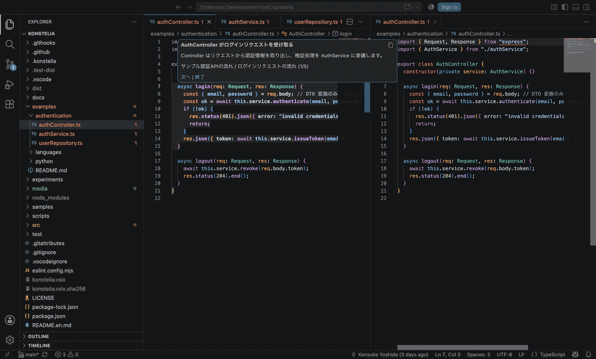
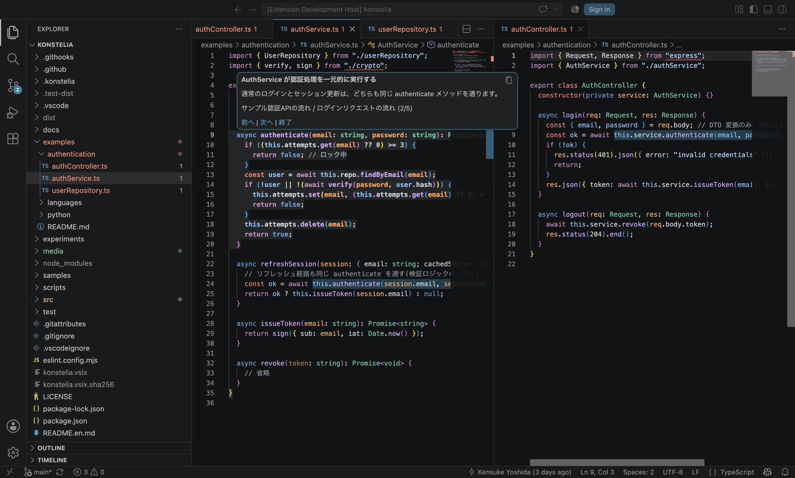

# Konstelia

English | [日本語](README.md)

Konstelia is a VS Code extension for creating and playing "code tours" that guide readers through meaningful locations in source code. Instead of relying on file line numbers, it locates code using language-specific symbol paths and structural refinements. This allows Konstelia to resolve anchors again or find repair candidates even after code is moved or lightly edited.

[View on the VS Code Marketplace](https://marketplace.visualstudio.com/items?itemName=kenten10.konstelia) · [GitHub](https://github.com/kenten10/konstelia) · [Bugs and feature requests](https://github.com/kenten10/konstelia/issues)

## 30-second demo



Move between hops with `Alt+Right` / `Alt+Left`. Konstelia opens the related files and shows the target code and explanation together.

## Why Konstelia helps

- **Tours survive code movement** — Konstelia locates code by symbol path and structure instead of line number, and suggests repair candidates when an anchor drifts.
- **Share the “why,” not just the “where”** — Explain the order of a flow across multiple files and show what readers should notice beside the relevant code.
- **Store tours at the right scope** — Keep a tour personal, attach it to the current workspace, or share it with the team through Git.
- **Catch stale guidance early** — Tours are evaluated as `healthy`, `drifted`, or `broken`, and Repository tours can also be validated from the CLI.

## Try it in 3 minutes

All you need is VS Code 1.96 or later.

1. Install Konstelia from the [VS Code Marketplace](https://marketplace.visualstudio.com/items?itemName=kenten10.konstelia).
2. Reload VS Code and open the Command Palette with `Cmd+Shift+P` or `Ctrl+Shift+P`.
3. Run **Konstelia: Play Sample Tour**.
4. Use `Alt+Right` to move forward, `Alt+Left` to move back, and **End Tour** in the popover to finish.

If you cannot use the Marketplace, download `konstelia.vsix` from the [latest GitHub Release](https://github.com/kenten10/konstelia/releases/latest), then choose **Views and More Actions (`...`)** > **Install from VSIX...** in the Extensions view.

## Actual screenshot



This example shows the primary anchor in the center and a supporting secondary anchor in the adjacent editor. The explanation, current hop, navigation, and exit action stay visible beside the code.

Konstelia is currently an MVP. It supports TypeScript/TSX, JavaScript/JSX, Python, Ruby, Rust, Go, Swift, Java, C#, C, C++, and Kotlin; single-root workspaces; YAML-based tour editing; and Personal, Workspace, and Repository scopes. A dedicated tour editor, flow diagrams, synchronization, and AI features are not yet available.

## Repository layout

```text
.konstelia/  Repository tours and semantic anchors
docs/        Specifications and implementation plan
examples/    Multi-language samples referenced by tours
experiments/ Spikes used to validate the initial design
samples/     Tour templates installed into each storage scope
scripts/     Pre-publication safety checks and Git hook setup
src/         Extension and CLI product code
test/        Unit tests run with Node.js
```

## Installation

### Install from the VS Code Marketplace

Select **Install** on the [Konstelia Marketplace page](https://marketplace.visualstudio.com/items?itemName=kenten10.konstelia). After installation, reload VS Code and run **Konstelia: Play Sample Tour** from the Command Palette.

### Install from a GitHub Release

VS Code 1.96 or later is required. Download `konstelia.vsix` and `konstelia.vsix.sha256` from the [latest Release](https://github.com/kenten10/konstelia/releases/latest), or run the following commands on macOS or Linux:

```bash
curl -LO https://github.com/kenten10/konstelia/releases/latest/download/konstelia.vsix
curl -LO https://github.com/kenten10/konstelia/releases/latest/download/konstelia.vsix.sha256
shasum -a 256 -c konstelia.vsix.sha256
code --install-extension konstelia.vsix --force
```

On Windows PowerShell, confirm that the following value matches the first value in `konstelia.vsix.sha256`, then install the extension:

```powershell
(Get-FileHash .\konstelia.vsix -Algorithm SHA256).Hash.ToLower()
code --install-extension .\konstelia.vsix --force
```

You can also select `konstelia.vsix` from **Views and More Actions (`...`)** > **Install from VSIX...** in the VS Code Extensions view. After installation, reload VS Code, open this repository, and run **Konstelia: Play Sample Tour** from the Command Palette.

The current MVP targets single-root workspaces. To guarantee that referenced source files are present, **Konstelia: Install Sample Tours** only continues installation in the bundled Konstelia workspace.

To uninstall Konstelia, remove it from the Extensions view or run:

```bash
code --uninstall-extension kenten10.konstelia
```

### Install from source

Node.js 20 or later, npm, and VS Code 1.96 or later are required. Run the following commands from the repository root to create a distributable `konstelia.vsix` and install it into your current VS Code installation:

```bash
npm install
npm run extension:install
```

To create the VSIX without installing it, run:

```bash
npm run extension:package
```

To create both the release VSIX and its SHA-256 checksum, run:

```bash
npm run extension:release
```

## Try it from source

Node.js 20 or later, npm, and VS Code 1.96 or later are required.

```bash
npm install
npm run validate
```

1. Open the repository root in VS Code.
2. Press `F5` to launch the Extension Development Host.
3. In the new window, press `Cmd+Shift+P` or `Ctrl+Shift+P`.
4. Run **Konstelia: Play Sample Tour**.

This command directly plays the Repository sample bundled with the extension. To copy the samples into each scope and try them from the regular list, run **Konstelia: Install Sample Tours** once, then use **Konstelia: Play Tour** and select Personal, Workspace, or Repository. Installation is idempotent and does not overwrite existing tours or anchors whose contents differ.

To ensure that referenced source files exist, Install Sample Tours only runs in the bundled Konstelia workspace. If you run it from another workspace, Konstelia asks for confirmation, opens the bundled workspace, and continues installation there.

To try samples for the supported languages, run **Konstelia: Play Tour**, select **Repository**, and choose a tour named after a language.

| Language | Tour | Source |
| --- | --- | --- |
| TypeScript | Sample authentication API flow | `examples/authentication/` |
| JavaScript | JavaScript order processing flow | `examples/languages/javascript/` |
| Python | Python order processing flow | `examples/python/` |
| Ruby | Ruby order processing flow | `examples/languages/ruby/` |
| Rust | Rust order processing flow | `examples/languages/rust/` |
| Go | Go order processing flow | `examples/languages/go/` |
| Swift | Swift order processing flow | `examples/languages/swift/` |
| Java | Java order processing flow | `examples/languages/java/` |
| C# | C# order processing flow | `examples/languages/csharp/` |
| C | C order processing flow | `examples/languages/c/` |
| C++ | C++ order processing flow | `examples/languages/cpp/` |
| Kotlin | Kotlin order processing flow | `examples/languages/kotlin/` |

The order-processing tours share the same sequence—finding a product, checking that it exists, saving the order, and returning it—so you can compare how each language expresses types, interfaces, protocols, traits, and related concepts. TSX and JSX are supported by the same adapters as TypeScript and JavaScript.

## Play a tour

Run **Konstelia: Play Tour**, then select a scope followed by a tour.

- Repository and Workspace lists show each tour as `healthy`, `drifted`, or `broken`.
- For Personal tours, Konstelia checks the source binding against the current workspace after you select a tour, then evaluates its health.
- A tour does not start when its primary anchor is broken.
- When a secondary anchor is broken, Konstelia warns you, skips that anchor, and continues.
- Drifted anchors show their fallback location and a warning so that the author can repair them later.

During playback, the target code is highlighted and an explanatory popover appears nearby.

- `Alt+Right`: move to the next hop
- `Alt+Left`: move to the previous hop
- **End Tour**: end the tour and close the highlight and popover

You cannot move backward from the first hop, and the final hop does not show a Next action. The final hop remains visible until you select **End Tour**.

## Create a tour

### 1. Choose a storage scope

Run **Konstelia: Create Tour**, choose a scope, and enter a title. Konstelia generates a safe ID and unique filename, then opens a minimal YAML file.

```yaml
id: authentication-overview
title: Authentication Overview
steps: []
```

Create Tour creates only the tour container. To make it playable, create anchors as described below and reference them from hops in the YAML file.

### 2. Create an anchor from source code

1. Open a supported language file in the workspace. TypeScript/TSX, JavaScript/JSX, Python, Ruby, Rust, Go, Swift, Java, C#, C, C++, and Kotlin are currently supported.
2. Select the function, method, property, conditional branch, return statement, function call, or other code you want to show in the tour.
3. Run **Konstelia: Create Anchor from Selection**.
4. Select the same scope as the tour.
5. Review the suggested anchor ID, edit it if necessary, and confirm it.

If the selection cannot be represented directly and must snap to a nearby type or entire function, a confirmation dialog shows the resolved target before it is saved. Cancel if the target is not what you intended. Direct symbol support for fields and properties varies by language adapter.

Konstelia generates a symbol path, refinement, normalized snapshot, and SHA-256 hash from the selection, then saves them to `anchors.yaml` in that scope. Tour YAML files and the anchor registry are separate files. Set each hop's `ref` to the ID of an anchor you created.

### 3. Edit the tour YAML

```yaml
id: authentication-overview
title: Authentication Overview
description: Follow a login request through session creation
steps:
  - id: login
    title: Login flow
    hops:
      - summary: Controller receives the login request
        body: |
          Extract the input and delegate processing to the authentication service.
        anchors:
          - ref: auth.controller.login
            emphasis: primary
          - ref: auth.service.authenticate-call
            emphasis: secondary
```

Each hop has the following constraints:

- `summary` is required and must fit on one line.
- `anchors` must contain at least one reference.
- There must be exactly one `emphasis: primary` anchor.
- Use `secondary` for supplementary anchors shown at the same time.
- Each `ref` must identify an entry in `anchors.yaml` in the same scope.
- Step IDs must be unique within a tour.

`prerequisites` and `links` are also schema-validated, but interactive navigation between linked steps is not implemented yet. Hops currently play in the order in which they are written.

### 4. Validate YAML and health

For Repository scope, you can use the CLI in addition to diagnostics shown on save:

```bash
npm run tour -- validate
npm run --silent tour -- validate --format json
```

Validation reports invalid YAML, duplicate IDs, missing anchors, broken links, cyclic prerequisites, and broken anchors. It exits with a nonzero status when broken anchors are present. Drifted anchors are reported but do not cause a failure exit status.

## Repair an anchor

When code movement or edits cause an anchor to become drifted or broken, you can update its target while keeping its stable ID. You do not need to rewrite the `ref` in tour YAML files.

### Use a selection as the repair target

1. Select the new target code.
2. Run **Konstelia: Repair Anchor from Selection**.
3. Select the scope and anchor to repair.
4. Review the diff between the saved snapshot and the new target.
5. Select **Rebind**.

### Find candidates in the workspace

1. Run **Konstelia: Repair Anchor Automatically**.
2. Select the scope and anchor to repair.
3. Follow the progress notification and select a target from the candidates ranked by similarity.
4. Review the diff and select **Rebind**.

Automatic discovery scans supported source files under the first workspace root. It excludes `node_modules`, `.git`, `dist`, `out`, `build`, `.konstelia`, and `.d.ts` files. Konstelia notifies you if unreadable files or cancellation resulted in partial results.

TypeScript and JavaScript use the TypeScript Compiler API to generate and resolve anchors. Python, Go, Rust, Java, C, and C++ use Lezer syntax trees. Ruby, Swift, C#, and Kotlin, for which official Lezer grammars are unavailable, use language-specific structural scanners that recognize comments, strings, and block boundaries. The UI and tour service access all of them through a common semantic-anchor interface.

If the target file is edited, deleted, or moved while you are reviewing a candidate, final validation stops the repair before saving. Select a candidate again.

A Personal anchor can be repaired only when every Personal tour that references it is bound to the current source workspace. For safety, repair is rejected when a tour is unbound, bound to another workspace, or when the anchor is shared by tours associated with multiple workspaces.

## Three storage scopes

| Scope | Purpose | Storage location | Source workspace |
| --- | --- | --- | --- |
| Personal | Available only to the individual VS Code user | Under `ExtensionContext.globalStorageUri` | Bound per tour in local metadata |
| Workspace | Available only in the current workspace | Under `ExtensionContext.storageUri` | Current workspace |
| Repository | Shared with a team through Git | `<workspace>/.konstelia/` | First current workspace root |

Personal and Workspace files are not written to the repository. Repository scope shares the following files:

```text
.konstelia/
  anchors.yaml
  tours/
    *.tour.yaml
```

Personal tour bindings do not store absolute paths in YAML. They are kept in VS Code user metadata. When you try to play a Personal tour in a different workspace, Konstelia asks for explicit confirmation before rebinding it.

Workspace scope is available only when a folder or workspace is open. The current implementation targets a single root and does not yet support explicit repository selection in a multi-root workspace.

## Open tour files

Use **Konstelia: Browse Tours** to choose a scope and open a saved tour YAML file. UI code does not construct storage paths; it passes the selected `TourScope` to the storage resolver.

## Commands

| Command | Purpose |
| --- | --- |
| **Konstelia: Create Tour** | Create a minimal tour YAML file |
| **Konstelia: Create Anchor from Selection** | Create an anchor from a selection in a supported source file |
| **Konstelia: Repair Anchor from Selection** | Rebind an existing anchor to the selected range |
| **Konstelia: Repair Anchor Automatically** | Discover repair candidates in the workspace |
| **Konstelia: Browse Tours** | Open a saved tour YAML file |
| **Konstelia: Play Tour** | Select a scope and tour, then play it |
| **Konstelia: Play Sample Tour** | Directly play the bundled Repository sample |
| **Konstelia: Install Sample Tours** | Idempotently install samples into all three scopes |

## FAQ

### Will adding or moving lines break a tour?

Konstelia does not rely on line numbers alone. It resolves targets using language-specific symbol paths, structural refinements, and snapshots. If it cannot follow a change completely, it reports the anchor as `drifted` or `broken`, and you can repair it from a selection or through automatic discovery.

### Which languages are supported?

Konstelia supports TypeScript/TSX, JavaScript/JSX, Python, Ruby, Rust, Go, Swift, Java, C#, C, C++, and Kotlin. The exact selection granularity available for fields, properties, and other constructs varies by language adapter.

### Can I share tours with my team?

Yes. Repository scope stores YAML under `.konstelia/`, so tours and anchors can be reviewed and shared through Git alongside the source code. Personal and Workspace scopes do not write to the repository.

### Is there a dedicated tour editor?

In the current MVP, commands create tours and anchors, while tour content is edited as YAML. Konstelia provides diagnostics on save, and Repository tours can also be checked with `npm run tour -- validate`.

### Are multi-root workspaces supported?

The current implementation targets single-root workspaces. Explicit repository selection in a multi-root workspace is not yet supported.

### A Personal tour appears broken in another workspace

Select the Personal tour from **Play Tour**, then review the **Rebind and Play** confirmation. Konstelia evaluates the tour's health in the current workspace after rebinding it.

### Automatic repair finds no candidates

Check that the target uses a supported language, is under the first workspace root, and has a saved snapshot in its anchor. If no candidates are found, select the target code and use **Repair Anchor from Selection**.

### Repository or Workspace scope is unavailable

Open the target folder in VS Code. A window containing only an individual file cannot resolve workspace storage or the repository root.

### A tour does not appear after editing its YAML

Check the Konstelia diagnostics in the Problems view. Invalid tour files are excluded from the regular list. For Repository scope, you can also run `npm run tour -- validate` for details.

## Development and validation

```bash
npm run compile      # Type-check and bundle the VS Code extension and CLI into dist/
npm run lint         # Run ESLint on src/ and test/
npm test             # Compile for testing and run Node.js unit tests
npm run check:public # Scan the working tree and Git history for private files and secrets
npm run validate     # Run compile, lint, tests, and pre-publication checks
```

Regular unit tests do not require a VS Code window. The `F5` debug configuration launches with other installed extensions disabled, keeping unrelated logs and network errors separate from Konstelia.

`npm install` enables the repository's `.githooks/pre-push` hook. Before each push, it scans both the current tree and Git history for environment files, private keys, common service token formats, generated artifacts, and files larger than 5 MiB. GitHub Actions runs the same checks.

See `docs/implementation-plan.md` for the implementation plan and `docs/code-tour-spec-v0.md` for the semantic-anchor and YAML format specification.

## License

Konstelia is released under the [MIT License](LICENSE). See [Third-Party Notices](THIRD_PARTY_NOTICES.md) for runtime dependency licenses and distribution notices.
